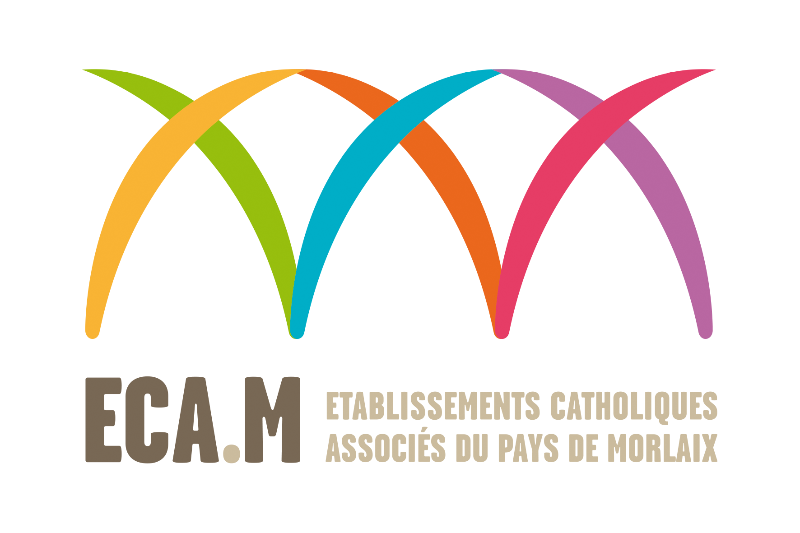
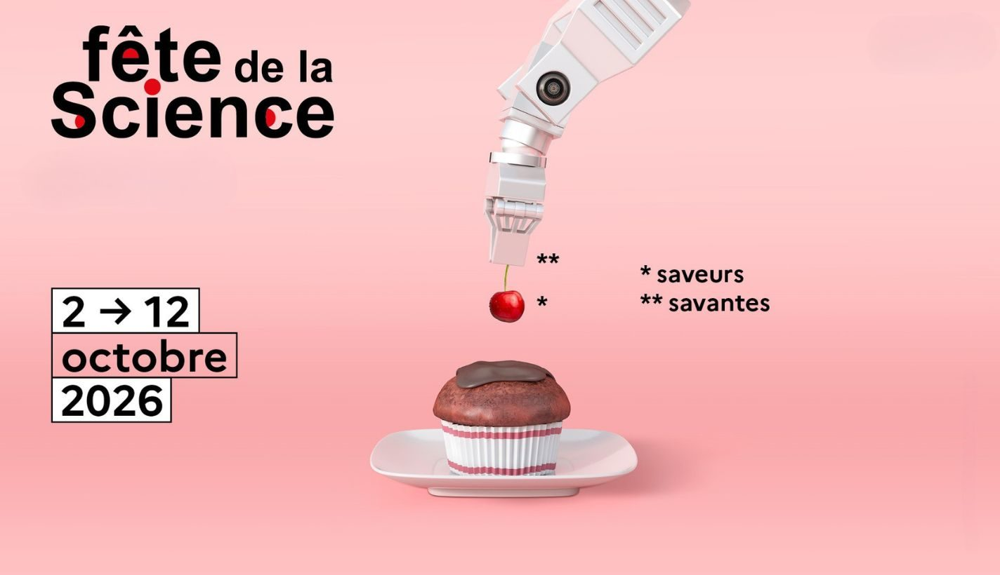
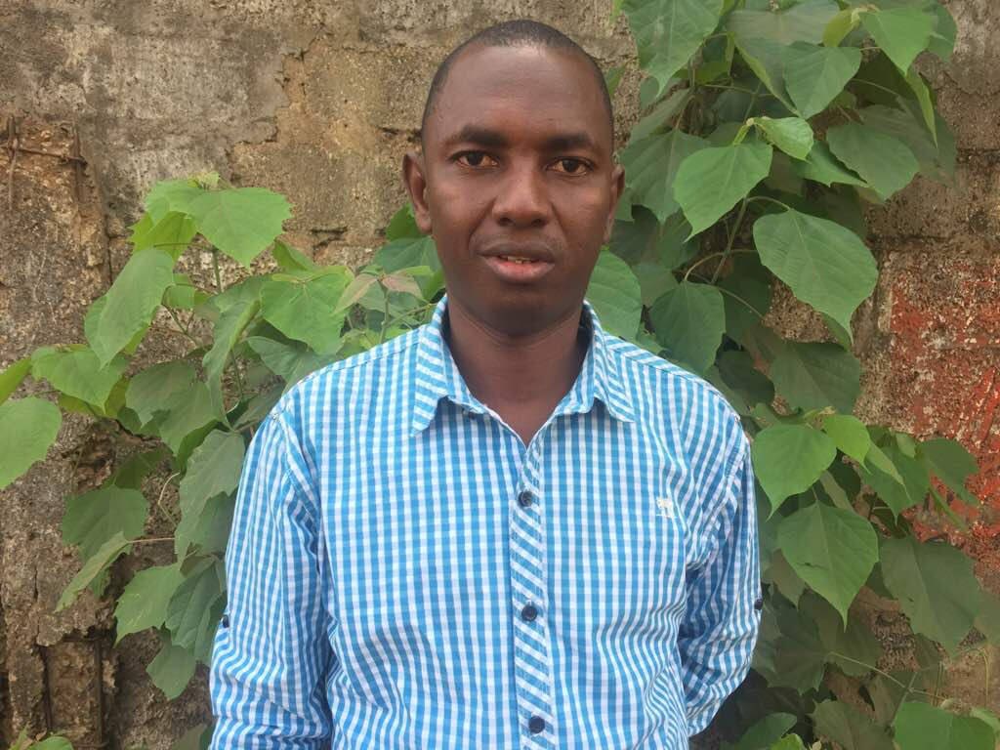
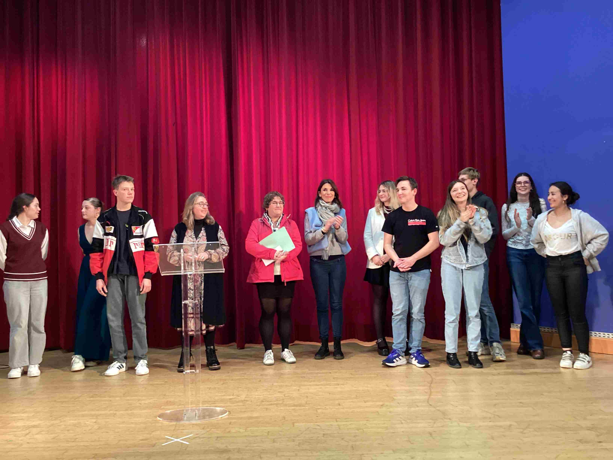
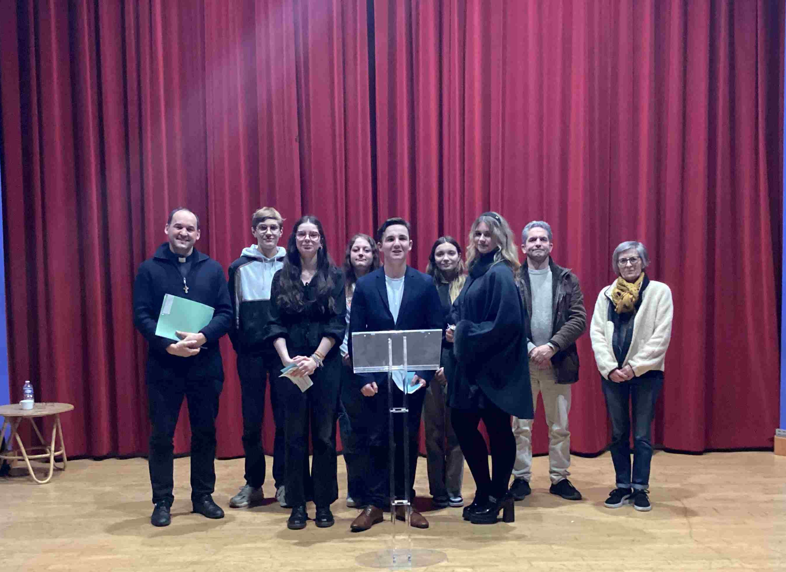
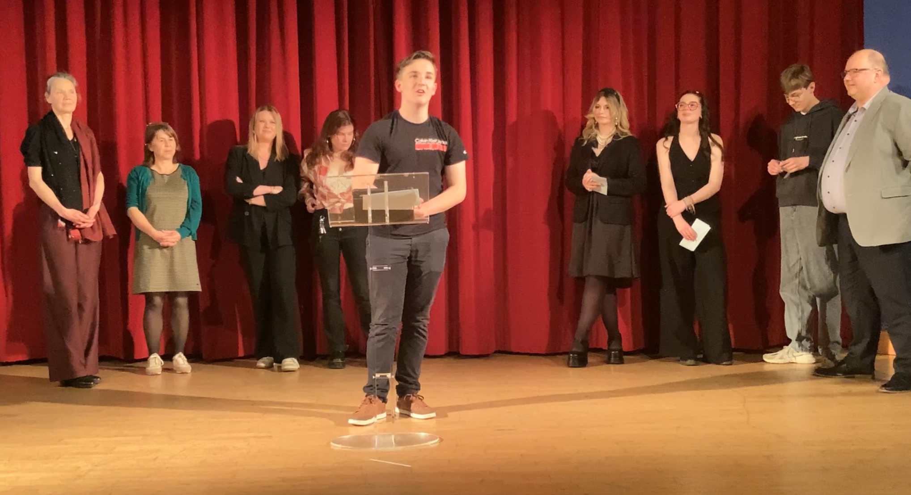
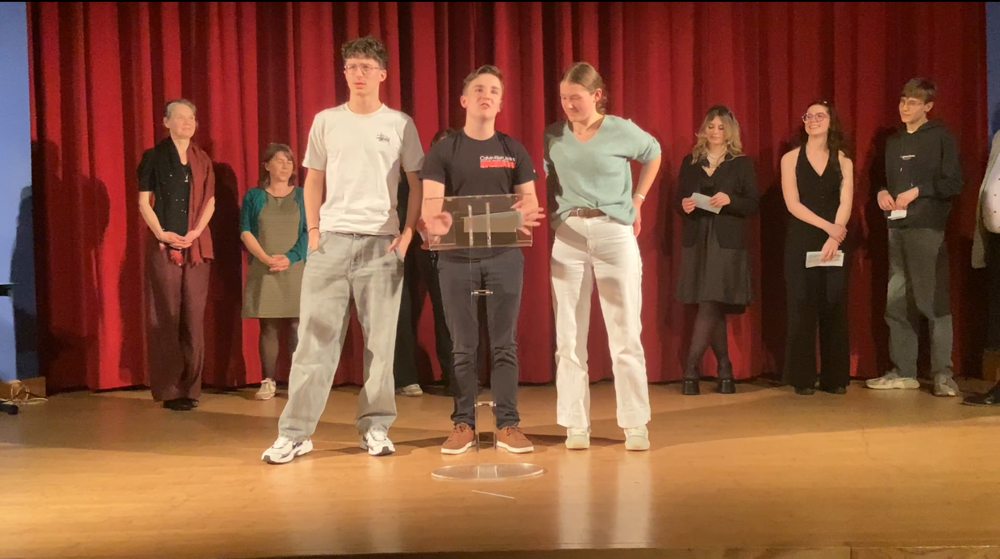
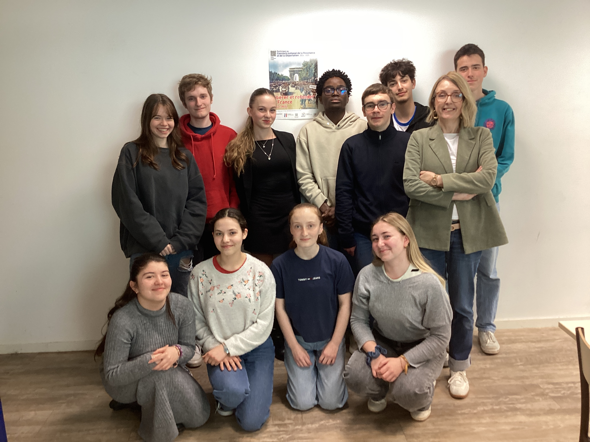

???+ example inline end "Actualités ECA.M"
       
    [{width=90% align=right}](https://www.ecmorlaix.fr/actualites/){target=_blank}

## Rendez-vous
???+ "**CAFE PHILO** ==<u>**Les rendez-vous CAFE PHILO**</u>=="
    {width=65% align=left}

    [**Sujets des "CAFE PHILO" 2024-2025**](./images/actualites/2024-2025_cafe_philo_compressed.pdf){target=_blank}

    [**Sujets des "CAFE PHILO" 2025-2026**](./images/actualites/2025-2026_cafe_philo_compressed.pdf){target=_blank}

## Expositions et projets
???+ "**FETE DE LA SCIENCE** ==<u>**Du 2 au 12 octobre 2026 : sur le thème des "Saveurs savantes"**</u>=="
    Programme sur le [site officiel](https://www.fetedelascience.fr/){target=_blank} de la Fête de la science 2026 et ressources pour aller plus loin.

    [{width=35% align=left}](https://www.fetedelascience.fr/){target=_blank}

  
??? "**Villes pour la vie, villes contre la peine de mort - ==<u>28/11/2025</u>==**"
    
    ==**Le combat de Souleyman Sow pour l'abolition de la peine de mort en Guinée**==

    [{width=35% align=right}](https://www.amnesty.org/fr/latest/news/2018/04/how-i-called-for-guinea-to-abolish-the-death-penalty/){targuet=_blank}
    
    Après la visite d'Antoinette Chahine, en 2023 et le spectacle "Sacco et Vanzetti" en 2024, dans le cadre de la journée mondiale des ==**"Villes pour la vie, villes contre la peine de mort"**==, nous accueillerons cette année Souleyman Sow, directeur d'Amnesty international Guinée, artisan de l'abolition de la peine de mort dans son pays. 

    Le 30 novembre 1786 est la date qui marque la Commémoration annuelle de la première abolition de la peine de mort par un Etat, le Grand Duché de Toscane, le 30 novembre 1786.
   
    Chaque 30 novembre, cette commémoration a pour objectif d'affirmer la valeur de la vie et de s'opposer à la peine de mort. Les « villes [engagées] villes pour la vie, villes contre la peine de mort » partout à travers le monde, s’illuminent pour dire à l'unisson ==**« Non à la peine de mort ! »**==. 

    La ville de Morlaix est engagée dans le combat contre la peine de mort relayé par les associations, [**Amnesty international**](https://www.amnesty.fr/){target=_blank}, l’[**ACAT**](https://www.acatfrance.fr/){target=_blank} et la [**Ligue des droits de l’homme**](https://www.ldh-france.org/){target=_blank}. Si ce combat vous intéresse, n'hésitez pas à vous rapprocher de l'une ou l'autre de ces associations.
    
  
## Nos élèves ont du talent

??? "**Concours d'éloquence**"
    [{width=35% align=left}](https://forms.cloud.microsoft/pages/responsepage.aspx?id=15R5OuUcb0Km4-7gYW4qbDS_24Hsan5FrtwwJDB35MdUNTA0VFZPS05ENDFOTUVaNjZNQjFKVEUxNi4u&route=shorturl){target=_blank}

    **Tu as des idées,**
    **Tu aimes débattre,**
    **Tu veux relever un défi,**

    C'est le moment de t'inscrire au ==**CONCOURS D'ELOQUENCE 2026-2027**==.

    Découvre les sujets du 1er tour [**ICI**](https://forms.cloud.microsoft/pages/responsepage.aspx?id=15R5OuUcb0Km4-7gYW4qbDS_24Hsan5FrtwwJDB35MdUNTA0VFZPS05ENDFOTUVaNjZNQjFKVEUxNi4u&route=shorturl){target=_blank}
    
    Tous les élèves du lycée peuvent encore s'inscrire.
    
    Le calendrier des différentes étapes du concours sera communiqué très prochainement.
    
    
    
    
    Photos souvenirs du concours de l'année dernière

    {width=45% align=left}
    {width=45% align=left}
    {width=55% align=right}
    {width=55% align=left}

??? "**CNRD 2024-2025**"
    **FELICITATIONS** aux onze élèves de TG2 et TG3 désignés ==**lauréats avec mention spéciale du jury, du Concours National de la Résistance et de la Déportation**== sur le thème **« Libérer et refonder la France »**. Encadrés par Mme GAMARD et Mme COZ, ils ont accompli un long travail de recherches et réalisé un film documentaire sur la libération de Morlaix : ==**« Morlaix 1944, l’aube de la liberté »**==. Pour répondre au format imposé par le concours les élèves avaient dû raccourcir leur film de 48mn à 17mn30 : un véritable crève-cœur ! Alors devant l’investissement et le travail colossal de tous et particulièrement de Pierre-Alain Wester, pour le montage final, les enseignantes avaient fait le choix d’envoyer les deux versions au concours. 
       
    *JEAN Henri – KINGUE PENSY Isaack - LARDEUX Samuel - LE MOULLEC Maëlie - LEPITRE Juliette - MORDELET--LIO Jade Lin - ROUAULT Jade - WESTER Pierre-Alain (TG2)*
        
    *HUON Emma - PINOTEAU Anaïs - PROUST-LABBE Théophile (TG3)*
    
    
    ==**BRAVO A TOUS !**==

    {width=65% align=left}
  

## Nouveautés

### Presse
???+ Info "**NOUVEAUTES PERIODIQUES** :newspaper:"
    Découvrez les magazines du mois en cours sur le ==**[Carrousel des nouveautés périodiques](https://ecmorlaix.basecdi.fr/pmb/opac_css/index.php){target=_blank}**== en bas de la page d'accueil du portail PMB.   
    
    Retrouvez tous ces périodiques au CDI pour lire, sur place, les articles qui vous intéressent ou emprunter un magazine.

      
    
???+ Info "**LIRE EN LANGUE ETRANGERE** :gb: :de: :es: :it: :cn:"
    
    Découvrez les magazines ou livres pour lire en langue étrangère ==**[ICI](https://ecmorlaix.basecdi.fr/pmb/opac_css/index.php?lvl=search_universe&id=10){target=_blank}**== en bas de la page d'accueil du portail PMB.   
    
    Retrouvez tous ces périodiques au CDI pour lire, sur place, les articles qui vous intéressent ou emprunter un magazine.
    ??? Example ":gb: **Anglais** :gb:"
    
    
    ??? Example ":de: **Allemand** :de:"
    
    
    ??? Example ":es: **Espagnol** :es:"
    

### **Orientation**
???+ "**Kiosque ONISEP**"
    Notices des dernières nouveautés à retrouver sur le [**Portail PMB**](https://ecmorlaix.basecdi.fr/pmb/opac_css/index.php?lvl=search_universe&id=6){target=_blank}.

### **Coups de coeur** :heart: 

- [**Littérature positive**](https://ecmorlaix.basecdi.fr/pmb/opac_css/index.php?lvl=search_universe&id=6){target=_blank} : sélection de romans pour tous. ==**A LIRE SANS MODERATION !**==

    
	

